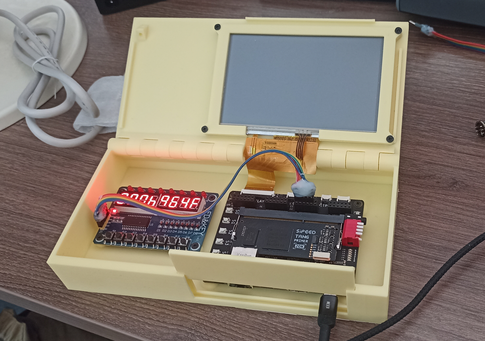

* Made in [KOMPAS-3D v23](https://kompas.ru/);
* Printed with PLA, 0.2mm layer height, 25% infill.

Parts required:

* Sipeed Tang Primer 20K Dock;
* 5-inch 800x480 LCD ([AliExpress](https://ali.click/uy0sxg));
* TM1638 board ([AliExpress](https://ali.click/z21sxu));
* Any wires to connect Tang Primer 20K to TM1638;
* 12x M2.5 nuts ([AliExpress](https://ali.click/alzrxv));
* 8x M2.5x8mm screws ([AliExpress](https://ali.click/nvzrxv)) for PCBs;
* 4x M2.5x12mm screws ([AliExpress](https://ali.click/nvzrxv)) for screen.

Tools required:

* 3D printer (tested with Ender 3 V3 SE);
* Something like soldering iron to heat up and insert nuts into plastic.
